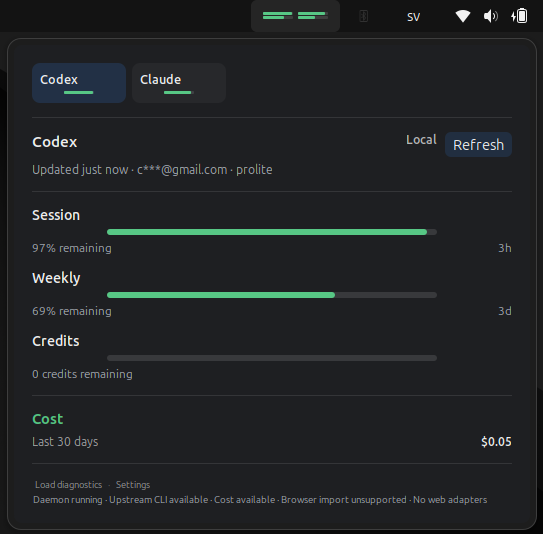
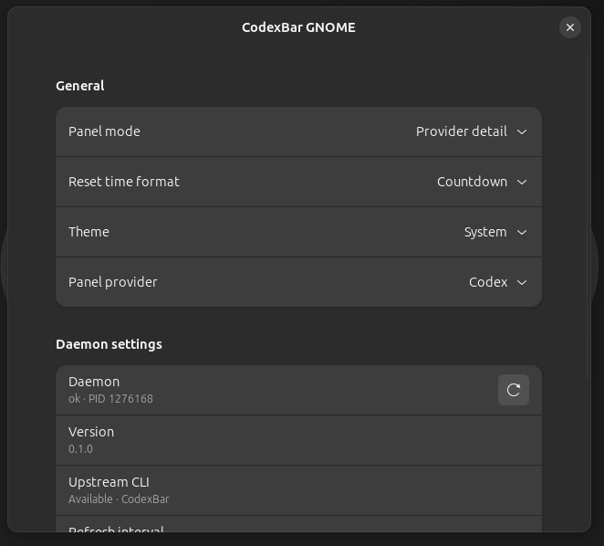
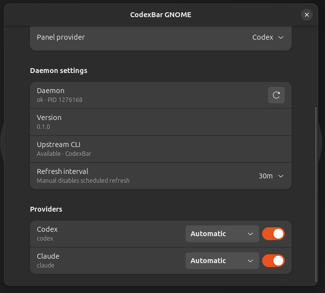

# CodexBar GNOME

Native Ubuntu/GNOME top-bar usage monitoring for AI coding providers, powered
by the upstream [CodexBar](https://github.com/steipete/CodexBar) CLI.

CodexBar GNOME installs a GNOME Shell extension and a user-scoped daemon. The
extension renders the panel indicator and popover. The daemon talks to the
upstream `codexbar` executable over local process calls, normalizes the result,
caches a snapshot, and exposes it to GNOME Shell over D-Bus.

This is not Electron, Tauri, an AppIndicator tray menu, a browser extension, or
a localhost web service.

## Status

CodexBar GNOME currently builds a local development `.deb` package for
Ubuntu/GNOME users who are comfortable installing a local package and
configuring the upstream CLI. `./scripts/build-deb.sh` prints the package path;
use that `.deb` as-is. The v0.2.0 release line targets upstream CodexBar CLI
v0.25.1 while the existing GNOME Shell behavior remains intact.

Primary target:

- Ubuntu Desktop 24.04 LTS
- GNOME Shell 46+
- Wayland-first desktop sessions
- `systemd --user` and D-Bus session activation

Release gates before final package sign-off:

- Ubuntu 26.04 LTS/GNOME 50 compatibility as a release gate.
- Full Ubuntu 24.04/26.04 package smoke matrix sign-off.
- Historical root-backed package install smoke evidence remains tracked for
  release audit context.

## What It Looks Like



| Settings: daemon and refresh | Settings: providers |
|---|---|
|  |  |

## What You Get

- A native GNOME top-bar indicator.
- A popover with provider cards, usage meters, stale/error states, daemon info,
  manual refresh, and compact diagnostics utilities.
- Preferences for panel mode, refresh interval, provider visibility, and
  provider source settings.
- A user daemon, `codexbar-linuxd`, activated through the D-Bus session service
  `org.codexbar.Linux1`.
- Normalized local cache for fast startup and stale rendering.
- Upstream `codexbar` CLI integration for Linux-supported CLI/API/local provider
  data and local cost summaries.

## Requirements

You need both pieces:

1. **CodexBar GNOME** from this repository.
2. **Upstream CodexBar CLI** from
   [steipete/CodexBar](https://github.com/steipete/CodexBar).

The `.deb` package does not bundle upstream `codexbar`. If the UI says
`upstream_cli_missing`, install upstream CodexBar CLI or point the daemon at its
path with `CODEXBAR_CLI`.

## Quick Start

### 1. Install Upstream CodexBar CLI

Linuxbrew:

```bash
brew install steipete/tap/codexbar
```

Or download a Linux CLI tarball from upstream releases:

```text
https://github.com/steipete/CodexBar/releases
```

Extract it somewhere stable, such as:

```bash
mkdir -p ~/.local/bin/codexbar-upstream
tar -xzf /path/to/CodexBarCLI.tar.gz -C ~/.local/bin/codexbar-upstream
chmod +x ~/.local/bin/codexbar-upstream/codexbar
```

Verify the upstream CLI before configuring GNOME:

```bash
codexbar --version
codexbar --format json --json-only --provider codex --source cli
codexbar --format json --json-only --provider claude --source cli
codexbar cost --format json --json-only --provider both
codexbar config validate --format json --json-only
```

If `codexbar` is not on your interactive shell `PATH`, use the extracted path:

```bash
~/.local/bin/codexbar-upstream/codexbar --version
```

### 2. Install CodexBar GNOME

From a downloaded `.deb`, including a package asset from the GitHub Releases
page:

```text
cp -f ./codexbar-linux.deb /tmp/codexbar-linux.deb
sudo apt install --reinstall /tmp/codexbar-linux.deb
codexbar-linux-setup
```

From this repository:

```bash
./scripts/build-deb.sh
```

Install the `.deb` printed by `./scripts/build-deb.sh`:

```text
cp -f ./dist/codexbar-linux.deb /tmp/codexbar-linux.deb
sudo apt install --reinstall /tmp/codexbar-linux.deb
codexbar-linux-setup
```

Run `codexbar-linux-setup` as the desktop user, not with `sudo`. It reloads the
user systemd manager, verifies `/usr/bin/codexbar-linuxd --check`, checks D-Bus
activation, detects user-local extension shadowing, and enables the GNOME
extension when the running Shell already discovers it.

### 3. Let the Daemon Find `codexbar`

If you installed with Linuxbrew in one of the standard Linuxbrew locations, the
daemon should find `codexbar` automatically.

If the UI shows `upstream_cli_missing`, set the executable path for the systemd
user manager and restart the daemon:

```bash
codexbar-linux-setup --codexbar-cli /absolute/path/to/codexbar
```

For a persistent login environment, write the same absolute path to
`~/.config/environment.d`:

```bash
mkdir -p ~/.config/environment.d
env_file=~/.config/environment.d/codexbar-linux.conf
printf '%s\n' 'CODEXBAR_CLI=/absolute/path/to/codexbar' > "$env_file"
codexbar-linux-setup --codexbar-cli /absolute/path/to/codexbar
```

Do not use `~` inside `environment.d`; write the full path.

### 4. Enable the GNOME Extension

The package installs the extension, but it does not enable it for you.
System-wide GNOME extensions live under
`/usr/share/gnome-shell/extensions/<uuid>` and are disabled by default.
`codexbar-linux-setup` attempts the enable step when GNOME Shell already
discovers the packaged extension.

```bash
codexbar-linux-setup
gnome-extensions enable codexbar-linux@codexbar.dev
gnome-extensions info codexbar-linux@codexbar.dev
```

On Wayland, log out and back in if GNOME Shell does not discover the system
extension immediately after install. System dconf defaults can enable
extensions for future sessions or users, but they cannot reliably make an
already-running GNOME Shell load a newly installed system extension.

The packaged extension path should be:

```text
/usr/share/gnome-shell/extensions/codexbar-linux@codexbar.dev
```

If `gnome-extensions info` reports a path under `~/.local/share`, a development
copy is shadowing the packaged extension.

### 5. Verify the Daemon

```bash
busctl --user call org.codexbar.Linux1 /org/codexbar/Linux1 org.codexbar.Linux1 GetDaemonInfo
journalctl --user -u codexbar-linuxd.service -n 100 --no-pager
```

Open the top-bar item and use Refresh. If provider authentication is missing,
the UI should show a recoverable provider/auth state rather than
`upstream_cli_missing`.

## Troubleshooting

### `upstream_cli_missing`

The daemon could not find an executable named `codexbar`.

Fix:

```bash
codexbar --version
codexbar-linux-setup --codexbar-cli /absolute/path/to/codexbar
```

If `codexbar --version` fails, install upstream CodexBar CLI first.

### `upstream_cli_not_executable`

The path exists, but it is not executable.

Fix:

```bash
chmod +x /absolute/path/to/codexbar
systemctl --user restart codexbar-linuxd.service
```

### Extension Does Not Appear

Check discovery:

```bash
gnome-extensions list | grep codexbar
gnome-extensions info codexbar-linux@codexbar.dev
```

On Wayland, log out and back in after installing system extension files.

### Package Install Shows `_apt` Sandbox Warning

Installing a local `.deb` from a private project directory can produce a
non-fatal `_apt` sandbox warning. Copy the package to `/tmp` and install from
there:

```text
cp -f ./dist/codexbar-linux.deb /tmp/codexbar-linux.deb
sudo apt install --reinstall /tmp/codexbar-linux.deb
```

Use the concrete filename printed by `./scripts/build-deb.sh`.

### Provider Shows Signed Out or Unavailable

CodexBar GNOME does not own provider login. Authenticate through the provider's
own CLI or upstream CodexBar setup, then rerun:

```bash
codexbar --format json --json-only --provider codex --source cli
```

## Privacy and Scope

CodexBar GNOME intentionally does not:

- read browser cookies;
- scan browser profiles;
- decrypt browser session material;
- read desktop keyrings or Secret Service entries;
- scrape provider dashboards;
- install a browser extension;
- expose a localhost or TCP API.

The daemon caches normalized snapshots, cost summaries, timestamps, safe source
metadata, and redacted diagnostics. Raw provider payloads and secrets are not
cached.

The retained `TestBrowserImport` D-Bus method is compatibility-only. It returns
a schema-valid `not_implemented` result without touching browser paths,
profiles, cookies, keyrings, or provider endpoints.

## How It Works

```text
GNOME Shell extension
        |
        | D-Bus session API: org.codexbar.Linux1
        v
codexbar-linuxd user daemon
        |
        | local process invocation
        v
upstream codexbar CLI and local provider tooling
```

Important paths:

```text
~/.config/codexbar-linux/config.json
~/.cache/codexbar-linux/snapshot.json
/usr/bin/codexbar-linuxd
/usr/bin/codexbar-linux-setup
/usr/share/dbus-1/services/org.codexbar.Linux1.service
/usr/lib/systemd/user/codexbar-linuxd.service
/usr/share/gnome-shell/extensions/codexbar-linux@codexbar.dev
```

## Supported Data Sources

The supported production data plane is upstream `codexbar` CLI plus local
provider tooling.

The default usage/status refresh targets Codex, then Claude, through the
upstream CLI source and does not default to `--provider all`. Explicit
`RefreshOptions.providers` can still request a different target. Current
upstream v0.25.1 cost output covers local Codex + Claude cost data. CodexBar
GNOME requests both supported local cost providers:

```bash
codexbar cost --format json --json-only --provider both
```

Other providers depend on what upstream CodexBar CLI supports on Linux through
CLI, API, OAuth, or local tooling. Upstream semantic source labels such as
`openai-web`, `web`, `oauth`, or `api` may appear in normalized provider
metadata when upstream CLI generated them. They do not mean CodexBar GNOME read
browser cookies, browser profiles, desktop keyrings, provider dashboards, or
web endpoints. Browser/web-only provider collection remains out of scope.

## Build and Development

Run the full repository check:

```bash
./scripts/check.sh
```

Useful narrower checks:

```bash
./scripts/validate-dbus.sh
./scripts/validate-schemas.sh
./scripts/validate-gsettings.sh
./scripts/validate-packaging.sh
./scripts/validate-no-browser-web-surface.sh
./scripts/build-deb.sh --check
./scripts/test-fixtures.sh
./scripts/lint-gjs.sh
cargo fmt --manifest-path daemon/Cargo.toml -- --check
cargo clippy --manifest-path daemon/Cargo.toml --all-targets -- -D warnings
cargo test --manifest-path daemon/Cargo.toml
```

Build the development package:

```bash
./scripts/build-deb.sh
```

The script writes `dist/codexbar-linux.deb`. That `.deb` can be attached to a
GitHub Release after the release gates pass.
See [GitHub Release Publishing](docs/github-release-publishing.md).

Run fixture-backed local development:

```bash
CODEXBAR_LINUX_ALLOW_FIXTURE=1 cargo run --manifest-path daemon/Cargo.toml
```

Optional live upstream CLI tests are ignored by default:

```bash
CODEXBAR_LIVE=1 CODEXBAR_CLI=/path/to/codexbar \
  cargo test --manifest-path daemon/Cargo.toml -- --ignored --test-threads=1
```

## Docs

- [Upstream CodexBar CLI Setup](docs/upstream-cli-setup.md)
- [Release Notes 0.2.0](docs/release-notes-0.2.0.md)
- [GitHub Release Publishing](docs/github-release-publishing.md)
- [Architecture](docs/ARCHITECTURE.md)
- [Security](docs/SECURITY.md)
- [Contracts](docs/CONTRACTS.md)
- [Release Smoke Test](docs/release-smoke-test.md)
- [GNOME Smoke Test](docs/gnome-smoke-test.md)
- [Upstream CLI UX States](docs/upstream-cli-ux.md)

## Relationship to Upstream CodexBar

CodexBar GNOME is a native Linux/GNOME companion for upstream CodexBar. It
preserves upstream provider semantics where Linux CLI/local sources make that
possible, but it does not fork the provider framework into browser scraping or
keyring/session extraction on Linux.

Upstream project:

```text
https://github.com/steipete/CodexBar
```

## License

See [LICENSE](LICENSE).
